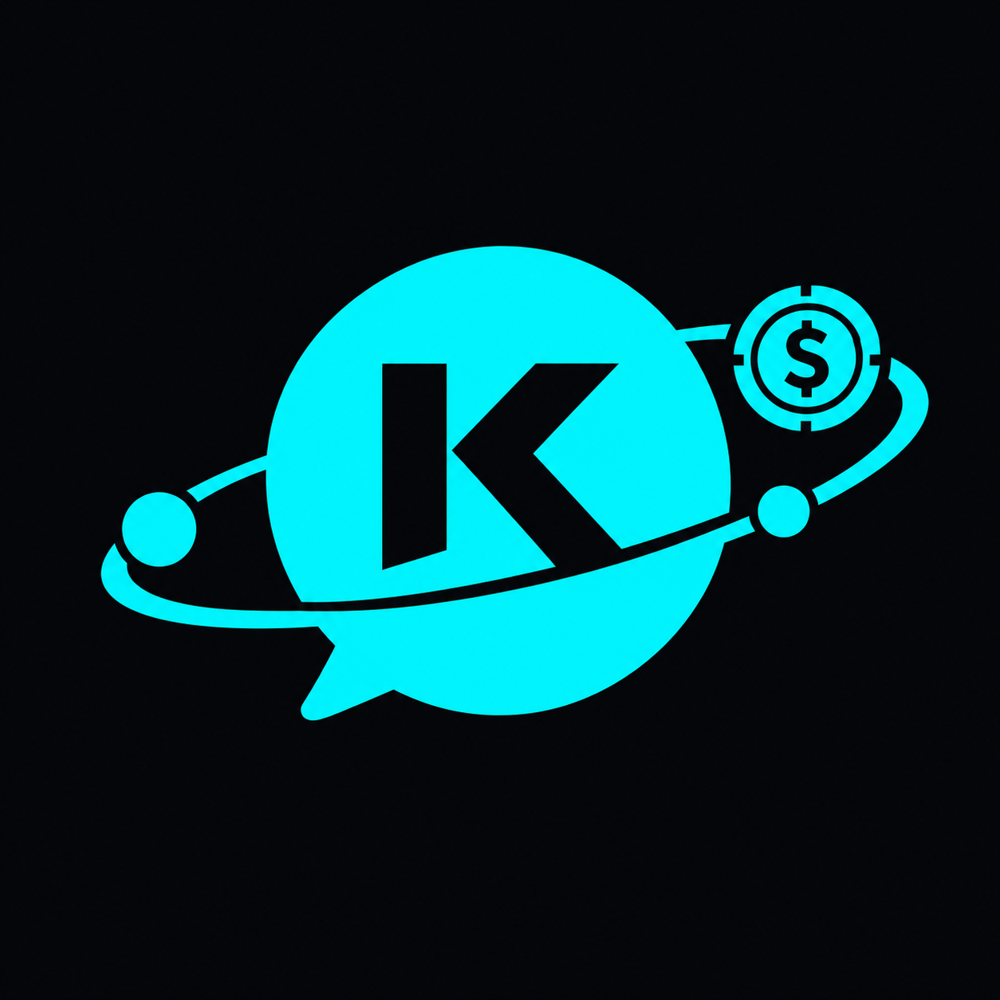

# Kosmovia · Logo

**Logo oficial: [`kosmovia-logo.png`](kosmovia-logo.png)**

Un globo de chat que es un planeta, con la **K** calada, un anillo en órbita, dos planetas y una **moneda cripto con $**. Cuenta las tres cosas que hace Kosmovia:

- **Comunidad y chat** (el globo de chat)
- **Personas conectadas en todo el mundo** (los planetas en órbita)
- **Dinero que se mueve** (la moneda: wallet y pagos en USDC)

## Colores

| Uso | Color |
| --- | --- |
| Logo | `#00F2FE` (cian) |
| Fondo | `#05080C` (casi negro) |

## Alternativa

[`kosmovia-logo-alternativa.png`](kosmovia-logo-alternativa.png): la misma idea con la moneda más simple. Usar solo si el oficial no se ve bien en algún tamaño.

## Pendiente

- Versión vectorial (SVG) y fondo transparente.
- Kit para redes (foto de perfil, portada, imagen para compartir) a partir del SVG.

Hasta tener el SVG, usen el PNG sobre fondo oscuro.
